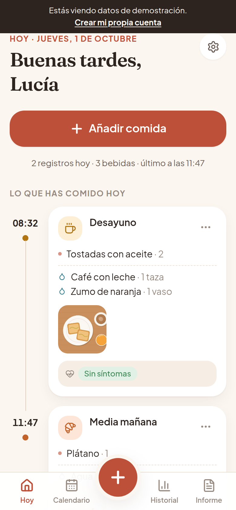
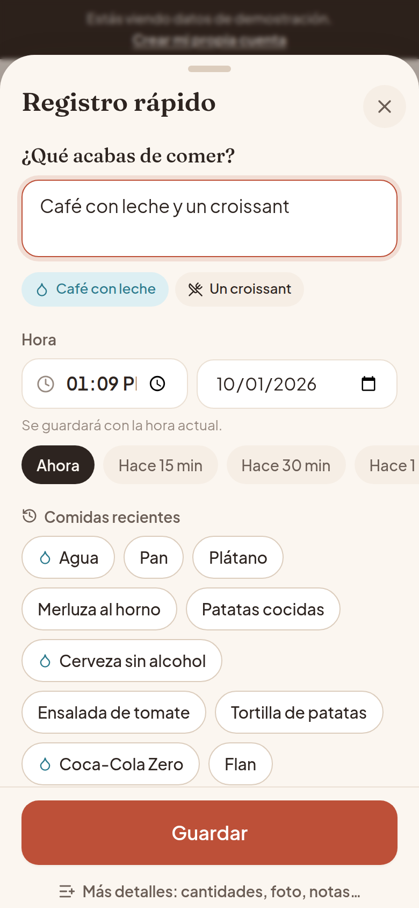
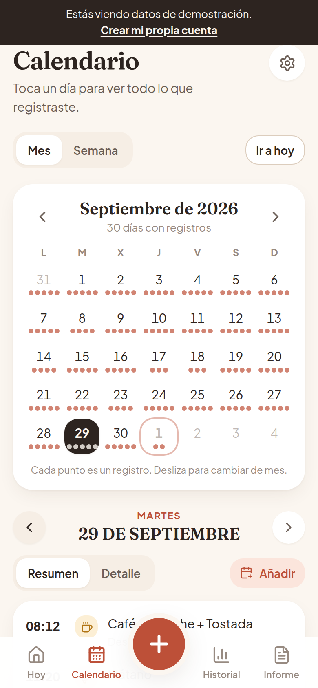
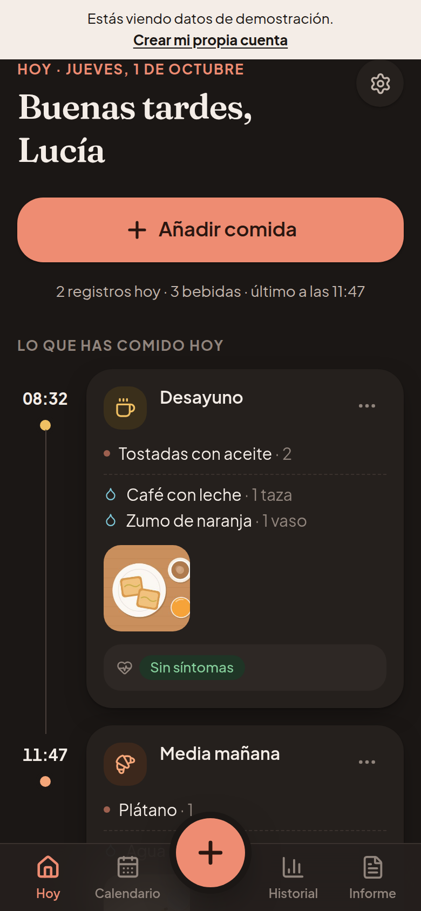

# Comida Amor · Diario de alimentación

Aplicación web (instalable en el móvil como app) para registrar **todo lo que se come y se bebe** cada día, con fecha y hora automáticas, y generar un **informe claro para el médico**.

Está pensada para una persona a la que su médico le ha pedido llevar un registro detallado de su alimentación, así que la prioridad es que **apuntar algo tarde solo unos segundos**.

> La aplicación **no diagnostica** ni sustituye el consejo médico. Solo registra, organiza y muestra la información. No juzga los alimentos ni pide calorías o macronutrientes.

<p>
  
  
  
  
</p>

## Qué incluye

| Sección | Funciones |
|---|---|
| **Hoy** | Fecha, saludo, botón grande «Añadir comida», lo registrado hoy en orden cronológico (hora, tipo, alimentos, cantidades, fotos, notas y síntomas), apartado **Bebidas de hoy** con registro de bebidas habituales en un toque, editar / repetir / eliminar. |
| **Registro rápido** | Botón «+» siempre visible (y tecla **N** en ordenador). «¿Qué acabas de comer?», hora automática editable («Hace 15 min», «Hace 1 h»…), **comidas recientes** que se añaden con un toque (ordenadas por lo que sueles tomar a esa hora), repetir una comida anterior, tipo sugerido por la hora. Se guarda con Enter. |
| **Añadir comida** | Varios alimentos y bebidas con cantidad aproximada y autocompletado, tipo (Desayuno, Media mañana, Comida, Merienda, Cena, Snack, Bebida, Otro), fecha y hora automáticas modificables, fotos opcionales, notas y el apartado opcional **«¿Quieres añadir cómo te encontrabas?»** (Sin síntomas, dolor abdominal, hinchazón, náuseas, acidez, diarrea, estreñimiento, otros + nota libre). |
| **Calendario** | Vista mensual y semanal, puntos por registro, detalle del día (resumen o detalle completo), navegación entre días, semanas y meses (también deslizando), añadir a un día pasado. |
| **Historial** | Buscador sin tildes ni mayúsculas («pizza» → «aparece en 9 días»), filtros por fecha, rango, tipo de comida, alimento concreto, solo con síntomas y solo con foto. |
| **Estadísticas** | Datos objetivos: días registrados, registros por día, horarios habituales por tipo de comida, distribución por horas, alimentos y bebidas más frecuentes, síntomas anotados. Sin recomendaciones ni relaciones causa-efecto. |
| **Informe** | Últimos 7, 14 o 30 días o fechas a elegir. Vista previa cronológica (fecha, hora, tipo, alimentos, cantidades, bebidas, notas, cómo se encontraba). **PDF** profesional en A4, **imprimir**, **compartir** (menú nativo del móvil) y **guardar** en el dispositivo. Opción de incluir fotos y días sin registros. |
| **Recordatorios** | Opcionales, a las horas que elijas, activables una a una. Para que no molesten: como mucho un aviso por hora elegida y día, y no avisa si has registrado algo hace poco. Notificaciones push reales (aunque la app esté cerrada); al tocarlas se abre el registro rápido. |
| **Ajustes** | Tema automático / claro / oscuro, nombre, cambiar contraseña, cerrar sesión en todos los dispositivos, descargar una copia de los datos (JSON), **borrar todos los registros** o **eliminar la cuenta definitivamente**. |

También: diseño cálido y minimalista (tarjetas redondeadas, iconos sencillos, animaciones suaves que respetan «reducir movimiento»), adaptado a móvil y ordenador, modo claro y oscuro, accesible con teclado y lector de pantalla, instalable como app (PWA) con accesos directos.

## Probarlo en local

Requisitos: **Node.js 22** o superior.

```bash
npm install
npm run dev          # API en :3001 y web en http://localhost:5173 (recarga automática)
```

Abre <http://localhost:5173> y pulsa **«Probar con datos de demostración»**: entra en una cuenta con 45 días de comidas de ejemplo (fechas relativas a hoy, con fotos, notas y algunos síntomas) para ver todas las pantallas funcionando. También puedes crear tu propia cuenta.

Versión de producción:

```bash
npm run build
npm start            # http://localhost:3001 (o el puerto de la variable PORT)
```

> En producción las cookies son solo HTTPS. Para probar la versión compilada en `http://localhost`, usa `COOKIE_SECURE=false npm start`.

### Pruebas

```bash
npm run typecheck    # TypeScript (cliente y servidor)
npm test             # 26 pruebas de la API, seguridad, recordatorios y utilidades
npm run build && npm run e2e   # recorrido completo con un navegador real + capturas en ./screenshots
```

La prueba de extremo a extremo recorre registro rápido (y deshacer), formulario completo con foto y síntomas, edición, borrado, calendario, búsqueda, filtros, estadísticas, descarga del PDF, ajustes, modo oscuro, escritorio y una cuenta nueva (incluido que una cuenta no puede ver los datos de otra).

## App publicada (Vercel + Supabase)

La versión que se usa en el día a día está publicada en **Vercel** y guarda los datos en **Supabase**:

```
Móvil / ordenador ── app (Vercel, estática, instalable) ──► Supabase
                                                             ├─ Auth: cuentas con correo y contraseña
                                                             ├─ Postgres con RLS: cada persona solo ve lo suyo
                                                             ├─ Storage privado: fotos (enlaces temporales de 1 h)
                                                             └─ Edge Functions + pg_cron: alta, borrado, recordatorios push
```

- `npm run build:web` genera la app (modo `web`, configuración pública en `client/.env.web`).
- `vercel.json`: compilación, reescritura de rutas y cabeceras de seguridad (CSP, HSTS…).
- `supabase/migrations/`: esquema, políticas RLS, almacén de fotos y tarea programada de recordatorios.
- `supabase/functions/`: `signup` (crea la cuenta ya confirmada), `delete-account` (borra registros o la cuenta y sus fotos, pidiendo la contraseña) y `send-reminders` (avisos push cada minuto y notificación de prueba).
- Las claves privadas de notificaciones y el secreto de la tarea programada están en `private.settings`, una tabla que no expone la API.
- Para cerrar el registro de cuentas nuevas: `update private.settings set value = 'false' where key = 'allow_registration';`
- `npm run e2e:web` prueba la app con un Supabase simulado en el navegador.

## Versión de prueba (sin servidor)

Además de la app completa, el proyecto genera una **versión que funciona entera en el navegador**, pensada para probarla sin instalar nada, por ejemplo publicada como página privada en claude.ai:

```bash
npm run build:artifact     # crea dist/artifact/comida-amor.html (+ fotos de ejemplo en dist/artifact/demo)
npm run e2e:artifact       # la prueba con un navegador real
```

Usa exactamente la misma interfaz; solo cambia dónde viven los datos (`client/src/local/`):

- Dentro de claude.ai, en el **espacio privado de cada persona** (nadie más lo ve, ni quien comparte la página); fuera, en el propio navegador (IndexedDB).
- Entrada solo con el nombre (sin contraseña) y botón para ver antes los datos de ejemplo, que no se guardan.
- El PDF se descarga con la descarga de claude.ai. No incluye imprimir, compartir ni notificaciones push (el visor de claude.ai no las permite): los recordatorios aparecen dentro de la app mientras está abierta.
- Las consultas (búsqueda, calendario, estadísticas) usan `shared/queries.ts`, y hay pruebas que comprueban que dan lo mismo que el servidor.

## Publicarla para usarla en el móvil

La app es un único servidor Node con una base de datos SQLite en disco, así que se puede alojar en cualquier servicio que ofrezca **un disco persistente** (Railway, Render, Fly.io, un VPS, un NAS en casa…). Debe servirse con **HTTPS** (lo dan estos servicios automáticamente).

Con Docker:

```bash
docker compose up -d --build     # http://localhost:3000, datos en el volumen «comida-amor-datos»
```

Variables de entorno (ver [`.env.example`](.env.example)):

| Variable | Para qué sirve |
|---|---|
| `DATA_DIR` | Carpeta con la base de datos, las fotos y las claves de notificaciones. **Debe ser persistente.** |
| `COOKIE_SECURE` | `true` (por defecto en producción) para que la sesión solo viaje por HTTPS. |
| `TRUST_PROXY` | `1` si la app está detrás de un proxy (casi siempre en servicios de hosting). |
| `DEMO_ENABLED` | Muestra el botón de demostración. Recomendado `false` cuando se use de verdad. |
| `ALLOW_REGISTRATION` | Permite crear cuentas. Recomendado `false` después de crear la tuya. |
| `VAPID_SUBJECT` | Correo de contacto para las notificaciones push (`mailto:…`). |

Después, en el móvil: abre la dirección, inicia sesión y usa **«Añadir a pantalla de inicio»**. En iPhone las notificaciones solo funcionan si la app se abre desde la pantalla de inicio (iOS 16.4 o posterior).

**Copias de seguridad:** basta con copiar la carpeta `DATA_DIR` (contiene `comida-amor.db` y `uploads/`).

## Privacidad y seguridad

- **Cuentas con contraseña** cifrada con *scrypt* (parámetros recomendados por OWASP); nunca se guarda en claro.
- **Sesiones** con cookie `HttpOnly`, `SameSite=Lax` y `Secure`; en la base de datos solo se guarda el *hash* del token. Cerrar sesión la invalida en el servidor; cambiar la contraseña cierra las demás sesiones.
- **Aislamiento de datos:** todas las consultas filtran por la usuaria de la sesión; las fotos solo se sirven a su dueña (`Cache-Control: private`) y nunca son públicas. Hay pruebas automáticas que lo comprueban.
- **Protección frente a ataques comunes:** comprobación de origen en las peticiones que modifican datos (CSRF), cabeceras de seguridad y *Content-Security-Policy* estricta (Helmet), límite de intentos de inicio de sesión, validación de todos los datos y de la firma real de las imágenes, mensajes de error que no revelan si un correo existe.
- **Fotos:** se reducen en el propio dispositivo antes de subirlas, lo que además elimina sus metadatos (como la ubicación GPS).
- **Sin terceros:** no hay analíticas, publicidad ni fuentes o scripts externos (las tipografías van incluidas). El *service worker* nunca guarda en caché datos personales.
- **Tus datos son tuyos:** exportación completa en JSON, borrado de todos los registros y eliminación definitiva de la cuenta (base de datos y archivos), siempre con confirmación y contraseña.
- La base de datos y las fotos se crean con permisos solo para el usuario del servidor. Para cifrado en reposo, usa un disco cifrado en el servidor.

## Arquitectura

```
client/              Aplicación web (React 19 + Vite + Tailwind CSS 4)
  public/            sw.js (notificaciones y modo sin conexión), manifest, iconos
  src/
    api/             Cliente HTTP y hooks de datos (TanStack Query)
    components/      Interfaz: hojas, tarjetas, formulario, registro rápido, gráficas
    context/         Editor de registros (abrir/editar desde cualquier pantalla) y avisos
    lib/             Fechas, borrador del formulario, PDF (jsPDF), fotos, tema, push
    pages/           Hoy, Calendario, Historial (+ estadísticas), Informe, Ajustes, Acceso
server/              API (Express 5 + SQLite con better-sqlite3)
  src/
    auth/            Contraseñas (scrypt), sesiones y middleware
    routes/          auth, account, entries (+ calendario, sugerencias, estadísticas), photos, reminders
    services/        Lógica de registros, fotos, consultas, recordatorios y push (Web Push/VAPID)
    seed/            Datos de demostración
    db.ts            Esquema y migraciones
  seed/photos/       Fotos ilustradas de la demo
  tests/             Pruebas de la API (Vitest + Supertest)
shared/              Tipos, constantes (tipos de comida, síntomas) y utilidades comunes
scripts/             Prueba de extremo a extremo y generadores de iconos/fotos demo
```

Decisiones principales:

- **Fecha y hora locales** (`AAAA-MM-DDTHH:MM`): cada registro pertenece al día en que lo vivió la usuaria, sin saltos por zonas horarias.
- **Búsqueda sin tildes** gracias a un texto normalizado guardado con cada registro.
- **Alimentos como filas propias** (con cantidad y si es bebida), lo que permite autocompletar, sugerir recientes, filtrar por alimento y contar los más frecuentes.
- **Registro rápido** que separa el texto libre en alimentos («Café con leche y un croissant» → 2 elementos) y detecta las bebidas automáticamente.
- **Recordatorios en el servidor**: se comprueban cada 30 s en la zona horaria de la usuaria y se envían por Web Push estándar; si el dispositivo no admite push, se muestra un aviso dentro de la app mientras está abierta.

## Limitaciones conocidas

- Para registrar hace falta conexión (la app abre sin conexión, pero no guarda registros sin red).
- El límite de intentos de inicio de sesión vive en memoria: pensado para una sola instancia del servidor.
- Las notificaciones push dependen del navegador: en iPhone requieren instalar la app en la pantalla de inicio.
